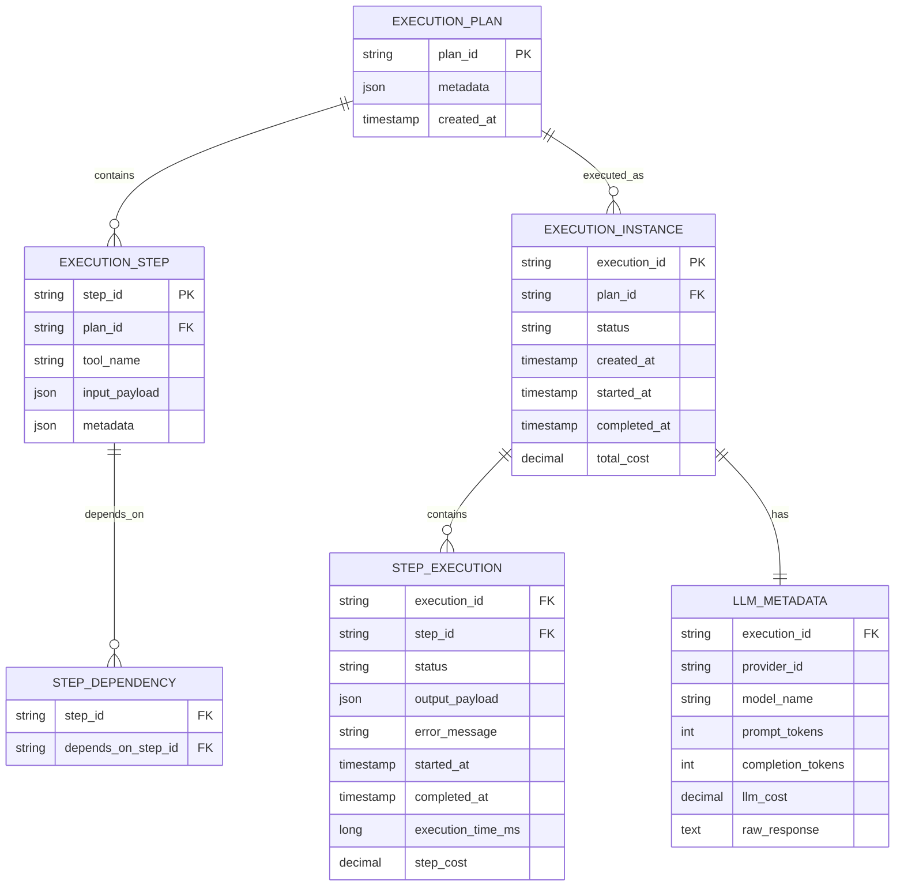

```mermaid

erDiagram

    EXECUTION_PLAN {
        string plan_id PK
        json   metadata
        timestamp created_at
    }

    EXECUTION_STEP {
        string step_id PK
        string plan_id FK
        string tool_name
        json   input_payload
        json   metadata
    }

    STEP_DEPENDENCY {
        string step_id FK
        string depends_on_step_id FK
    }

    EXECUTION_INSTANCE {
        string execution_id PK
        string plan_id FK
        string status
        timestamp created_at
        timestamp started_at
        timestamp completed_at
        decimal total_cost
    }

    STEP_EXECUTION {
        string execution_id FK
        string step_id FK
        string status
        json   output_payload
        string error_message
        timestamp started_at
        timestamp completed_at
        long execution_time_ms
        decimal step_cost
    }

    LLM_METADATA {
        string execution_id FK
        string provider_id
        string model_name
        int prompt_tokens
        int completion_tokens
        decimal llm_cost
        text raw_response
    }

    EXECUTION_PLAN ||--o{ EXECUTION_STEP : contains
    EXECUTION_STEP ||--o{ STEP_DEPENDENCY : depends_on
    EXECUTION_PLAN ||--o{ EXECUTION_INSTANCE : executed_as
    EXECUTION_INSTANCE ||--o{ STEP_EXECUTION : contains
    EXECUTION_INSTANCE ||--|| LLM_METADATA : has
```