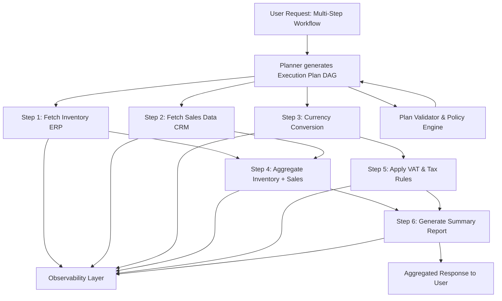

---

## Diagram Explanation

1. Planner generates DAG from the user request.
2. Parallel Steps (C1, C2, C3)
   - Independent steps can execute concurrently.
   - Tool executions are deterministic.
3. Dependent Steps (D1, D2 → E1)
   - Wait for required predecessors.
   - Data from prior steps is interpolated.
4. Policy Validation
   - Ensures steps are allowed before execution.
   - Can block or prune unsafe steps.
5. Observability
   - Logs every step input/output, execution time, and failures.
6. Aggregated Response
   - Combines all outputs and LLM summaries into the final response.