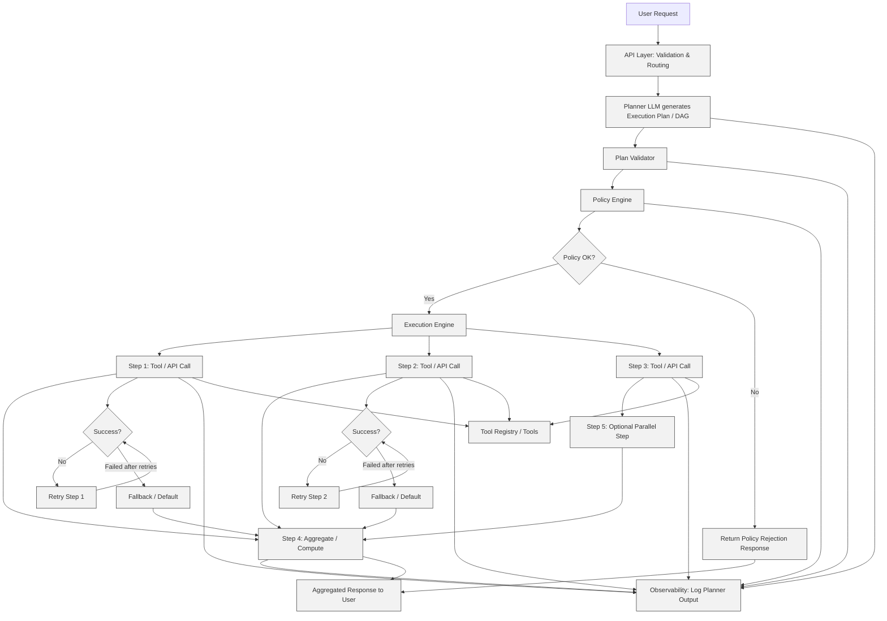

---

## Diagram Explanation

1. User Request → API Layer: validates and routes request.
2. Planner: generates structured DAG with dependencies.
3. Plan Validator & Policy Engine: ensures plan is valid, safe, and within cost/permissions.
4. Execution Engine: handles parallel steps, dependent steps, retries, and fallbacks.
5. Tool Registry: deterministic tools execute all non-LLM logic.
6. Observability Layer: logs all reasoning, plan validation, execution steps, retries, fallbacks, and metrics.
7. Aggregated Response: returned to user after execution completes (or rejected if policy fails).

This diagram combines all three previous flows (standard, parallel, retry/fallback) into a single comprehensive view of the system lifecycle.