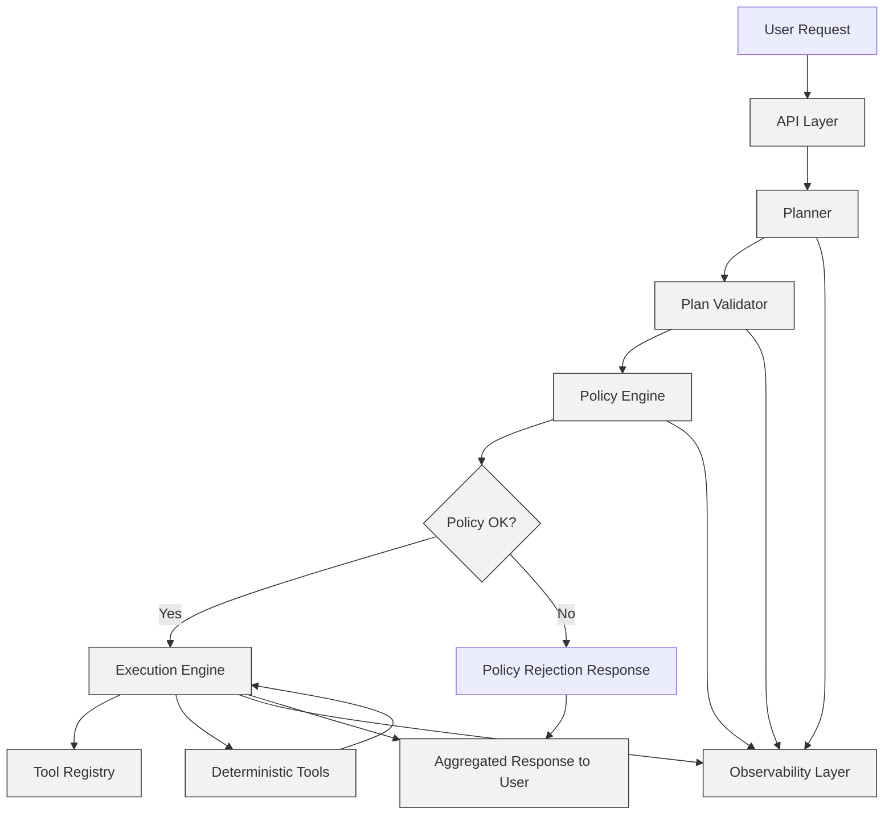

---

## Diagram Explanation

### User Request → API Layer 
- Validates incoming request, passes to Planner.

### Planner (LLM) → Plan Validator
- Planner generates structured DAG of steps.
- Validator enforces schema and tool availability.

### Policy Engine → Execution Engine
- Checks permissions, cost ceilings, sensitive tools.
- Can reject the plan (H) or allow execution (G).

### Execution Engine
- Resolves DAG dependencies
- Executes deterministic tools
- Handles retries, fallbacks
- Interacts with Tool Registry for metadata
- Logs everything to Observability Layer

### Observability Layer
- Collects all traces:
  - Planner output
  - Validation results
  - Policy decisions
  - Tool inputs/outputs
  - Latency and token usage

### Aggregated Response
- Combines tool outputs and LLM summaries
- Returns to the user
- Includes confidence and policy metadata