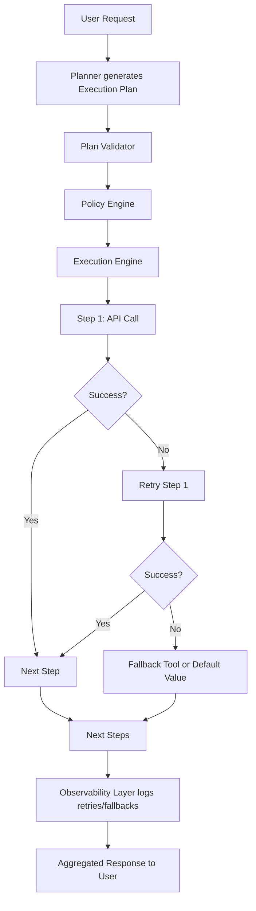

```mermaid

flowchart TD

A[User Request] --> B[Planner generates Execution Plan]
B --> C[Plan Validator]
C --> D[Policy Engine]
D --> E[Execution Engine]

    %% Step execution with failure
    E --> F[Step 1: API Call]
    F --> G{Success?}
    G -- Yes --> H[Next Step]
    G -- No --> I[Retry Step 1]
    I --> J{Success?}
    J -- Yes --> H
    J -- No --> K[Fallback Tool or Default Value]

    H --> L[Next Steps]
    K --> L

    L --> M[Observability Layer logs retries/fallbacks]
    M --> N[Aggregated Response to User]

```