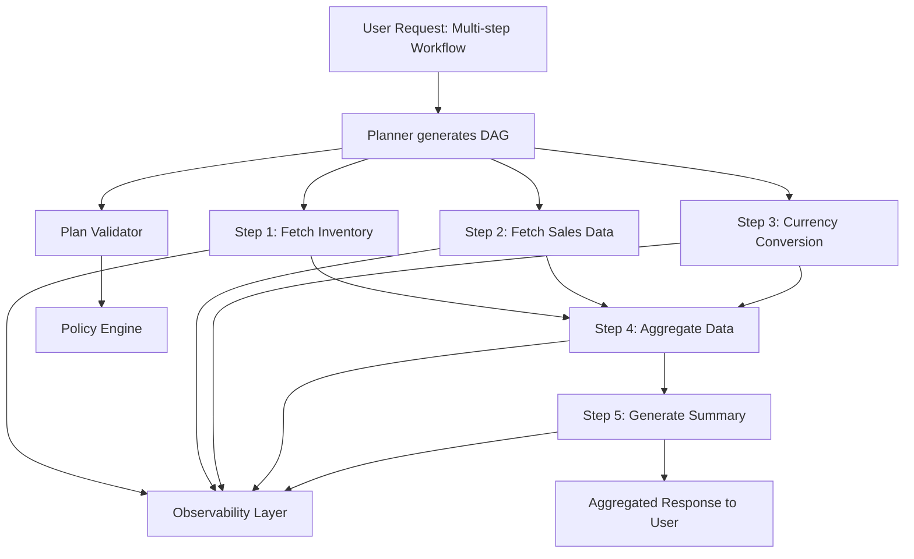

```mermaid
flowchart TD
    A[User Request: Multi-step Workflow] --> B[Planner generates DAG]

    %% Parallel steps
    B --> C1[Step 1: Fetch Inventory]
    B --> C2[Step 2: Fetch Sales Data]
    B --> C3[Step 3: Currency Conversion]

    %% Dependent aggregation
    C1 --> D[Step 4: Aggregate Data]
    C2 --> D
    C3 --> D

    D --> E[Step 5: Generate Summary]

    %% Observability and Policy
    B --> F[Plan Validator]
    F --> G[Policy Engine]
    C1 --> H[Observability Layer]
    C2 --> H
    C3 --> H
    D --> H
    E --> H

    E --> I[Aggregated Response to User]
```