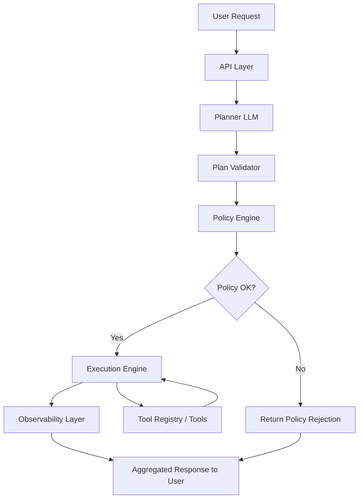

```mermaid

flowchart TD
    A[User Request] --> B[API Layer]
    B --> C[Planner LLM]
    C --> D[Plan Validator]
    D --> E[Policy Engine]
    E --> F{Policy OK?}
    F -- Yes --> G[Execution Engine]
    F -- No --> H[Return Policy Rejection]

    G --> I[Tool Registry / Tools]
    I --> G
    G --> J[Observability Layer]
    J --> K[Aggregated Response to User]

    H --> K
    
```